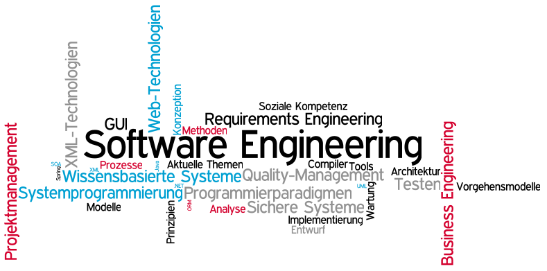
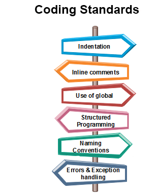

It is a tough semester since our lives have been influenced by the COVID pandemic. However, adjusting personal plans for adapting emergency in life is a significant lesson for me to survive in any circumstance no matter in daily life or work. This course ICS 311 is an interesting course because it’s my first time to learn how to build complete software rather than small scripts. It is also challenging for me since it requires me to acquire many different skills. Two of my favorite topics during ICS 311 are Coding Standards and Ethics in Software Engineering.

<h2>Coding Standards</h2>

Coding standards is some specific rules and guidelines that programmers should flow for writing code because it is important for collaborating with teammates in projects. It is a basic but important software engineering skill, which is a habit about the way we code our program. It’s very similar to we follow the same English grammar when we write articles. Following coding standards in a project does not improve the time and space complexities of the program, but it can save a lot of work for people in the big picture.

If we do not follow the coding standards in a group project, it will be a nightmare for everyone in the group because they have no way to understand each other’s work without any comments. Even if we review ourselves work after several weeks, we might take some time to memorize the way we coded. In a group project, we often collaborate with each other to enhance or create new features. Following the coding standards when we code can save a lot of time to explain what the codes actually do for each other. Therefore, the code will be more readable and good for enhancements.

In my final project, we create an online trading platform “ManoaList”. It has multiple functionalities and features. Sometimes we need to enhance and create new features based on each other’s work. We do not waste time on explaining works to each other and feel comfortable to collaborate with each other because we all followed the coding standard. Therefore, we work with each other on an efficient way, and then we always can finish works ahead of time.
	
<h2>Ethics in Software Engineering</h2>

Ethics in software engineering is important topic for designing applications because our products are created for people. Personally, ethics means that we must respect individual’s free will and be responsible for users as software developers. We should never force users to make choices or make choices for users in our applications, even if our original purposes are bringing convenience for people.

In my final project, when I create the page of Customer service, I create a form for users, which contains their information and descriptions. The form is asking users to fill out their name for submitting, but my teammate think we should not force people to write down their names because some people might not want to do it. Therefore, I keep the option for user to fill out their name, but it is not a requirement for submitting the form to customer service because it is not very necessary for the functionality. It is a little thing for the whole project, but the little thing can reflect possible issues on some points. In the future, I will try to be ethical and stand on users position to consider questions for developing software.
