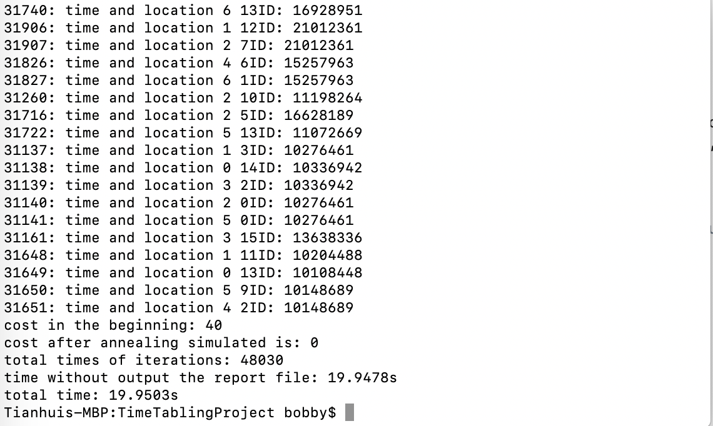
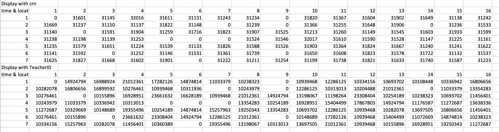

<div class="ui images">
  
  
</div>

<h2 id="overview">Project Overview</h2>
The problem that we are trying to solve in this project is to automate the task of creating classroom timetables which is an NP problem. An NP problem is a hard problem that cannot be solved in polynomial time which is more difficult than problems that can be solved in polynomial time. This is important because it can save time for administrators to determine class schedules.

<h2 id="contribution">My Contribution</h2>
In this project, I complete the sequential version of the program by implementing Simulated Annealing Algorithm. And I finished the data convertion so that the program is able to read data from input files and compute its result as a csv file to show the details of the schedule.

I handle the problems that adding probabilities to accept "Bad Move".
<h3 id="explanation">What is the cost of the schedule problem</h3>
Cost: It represents the numbers of clashes. There are two situations that will cause Cost. (1) when a teacher has more than one course at a time period, it will cause cost since a teacher is only able to take one course at a time. (2) when a classroom includes more than one course at a time period, it will cause cost since the capacity of each classroom is one per time. Both situations can happen at the same time. Therefore, the range of possible cost when we move around a course is [-2, 2]. If the cost is 0, it represents the current solution is perfect that does not contain any clash for the two situations.

Here is some code about Cost that how I calculate the cost:

```js
if (schedule[time_tem][loc_tem] >  1) { // clash in time&location
			if (schedule[row_tem][col_tem] == 0)
				dif_cost++;
		} else { //no clash
			if (schedule[row_tem][col_tem] > 0)
				dif_cost--;
		}
        
        if(row_tem != time_tem){
		if (schedule2[time_tem][index_teacher] > 1) { // there is a clash in time&teach
			if (schedule2[row_tem][index_teacher] == 0)
				dif_cost++;	
		} else {
			if (schedule2[row_tem][index_teacher] > 0) 
				dif_cost--;
		}
        }
```

There are some pictures for testing example, which is scheduling 100 courses and 47 teachers to 16 classrooms and 7 time periods.


The program is able to read input files and output a timetable as csv file to show the details.


<h2 id="experience">My Gain</h2>
In this project, I learned that how to work with other people as a team. Everyone in a group should take their own responsibilities and contribute their strengths to push forward the project. Furthermore, having quality and efficient communication with teammate is important because it can make sure everyone works on the same page and reduce producing error.

link of the code: <a href="https://github.com/ICSatKCC/TimeTablingProject"><i class="large github icon"></i>Timetable</a>


