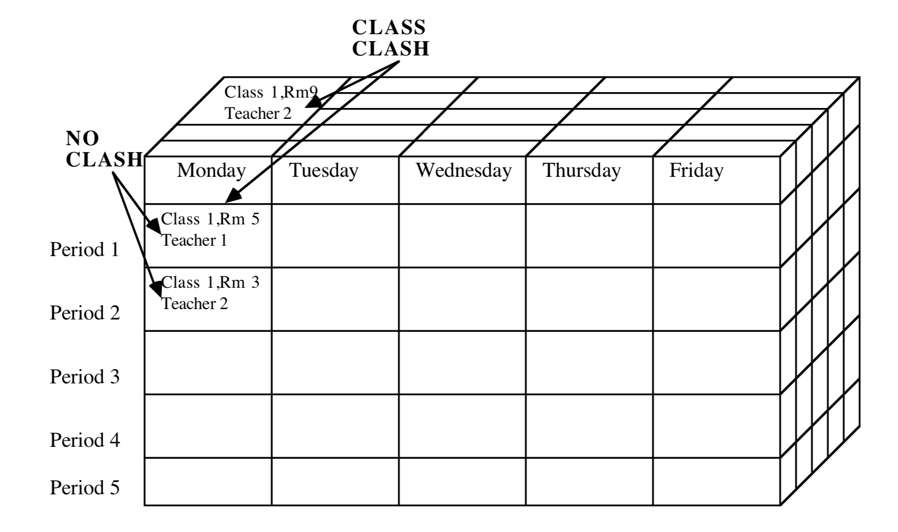

<div class="ui images">
  
  
</div>


The problem that we are trying to solve in this project is to automate the task of creating classroom timetables which is an NP problem. An NP problem is a hard problem that cannot be solved in polynomial time which is more difficult than problems that can be solved in polynomial time.  This is important because it can save time for administrators to determine class schedules.

In this project, I take charge of the coding part, which includes implementing Monte Carlo and Annealing simulated algorithms. Monte Carlo and Annealing simulated are randomly optimization algorithms that reduce the cost by randomly moving around courses. Cost means the total amount of class clash in our solution, which includes the clash of time & location and time & teacher. Cost is an important variable for valuing the solution, so a good solution always come out a small cost. And I wrote the cost function to make sure the program works.
Here is some code about Cost that how I calculate the cost:

```js
if (schedule[time_tem][loc_tem] >  1) { // clash in time&location
			if (schedule[row_tem][col_tem] == 0)
				dif_cost++;
		} else { //no clash
			if (schedule[row_tem][col_tem] > 0)
				dif_cost--;
		}
        
        if(row_tem != time_tem){
		if (schedule2[time_tem][index_teacher] > 1) { // there is a clash in time&teach
			if (schedule2[row_tem][index_teacher] == 0)
				dif_cost++;	
		} else {
			if (schedule2[row_tem][index_teacher] > 0) 
				dif_cost--;
		}
        }
```
In this project, I learned that how to work with other people as a team. Everyone in a group should take their own responsibilities and contribute their strengths to push forward the project. Furthermore, having quality and efficient communication with teammate is important because it can make sure everyone works on the same page and reduce producing error.

link of the code: <a href="https://github.com/tianhuizhou/Timetable"><i class="large github icon"></i>tianhuizhou/Timetable</a>


