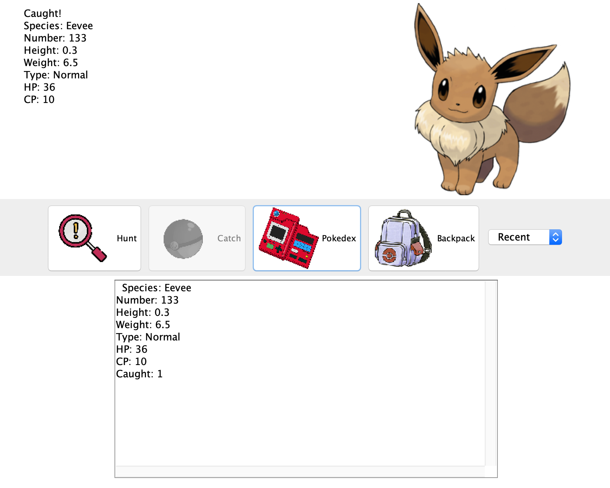

this is a simple pokemon game by implementing java Gui. I used priority queue to sort the pokemon, and show them in order. It can find different kinds of pokemons and catch them by some possibility. The pokemons we catched will be put on our backpack, and we can check and print the list of what we got. 

This is a homework project in ICS 211. The assignment did not require us to show the picture for corresponding pokemons. After I reached the assignment requirement, I developed it by putting in corresponding pokemon pictures, and make the user interface looks nice.

This is my first GUI program with some functionalities. It's the first time I can perform my program with people by user interface, so they can play with it. And some functionalities is from previous assginments, and I just wrap them up. Any big project can be split to many small pieces. A good plan can make us feel easier when we try to finish a big project. 

 
 
Source: <a href="https://github.com/tianhuizhou/Pokemon-game"><i class="large github icon"></i>tianhuizhou/Pokemon-game</a>
