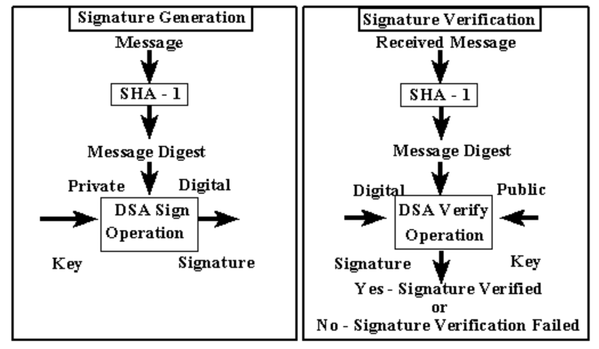

SHA-1 is the secure hash algorithm, which required for use the Digital signature Algorithm(DSA) as specified in the Digital Signature Standard (DSS) and whenever a secure hash algorithm is required for federal applica- tions. It is a final project in ICS 212.

The homework is released in the beginning of the spring break, and the professor Lisa Miller gave us two months to finish it. I finished the assginment of SHA-1 in one day by myself. The program pass all the tests and run perfectly. 

It's a very interesting assignment that give me some information about encryption and computer security. It helps me to check what skills I learned from ICS 212. In this final project, I learned that We should never try to be lazy when we type code. If we need to print some stuff for debug, we should never forget it because it might hurt us when a big program have some bugs. Appropriate comments also can help us when we check the correctness.  

Source: <a href="https://github.com/tianhuizhou/SHA-1"><i class="large github icon "></i>tianhuizhou/SHA-1</a>

