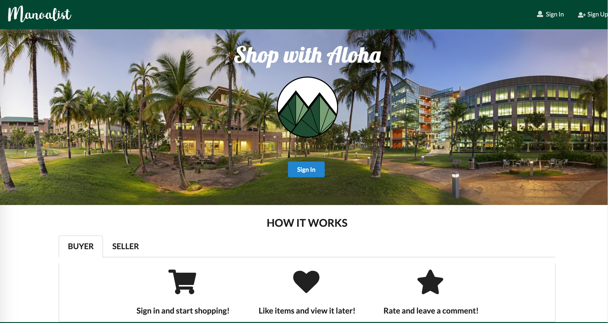

  
  

<h2 id="project-overview">Project Overview</h2>
ManoaList is a platform for UHM students to trade their stuffs. Students must register accounts with their UH email. Students can post their information to the platform, and people are able to contact with them for buying products.

<h2 id="project-overview">My Contribution</h2>

link of the code: <a href="https://github.com/tianhuizhou/Timetable"><i class="large github icon"></i>tianhuizhou/Timetable</a>
