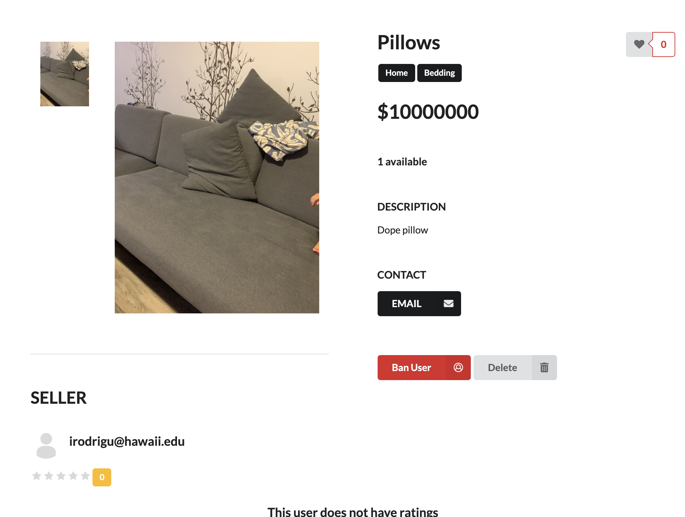
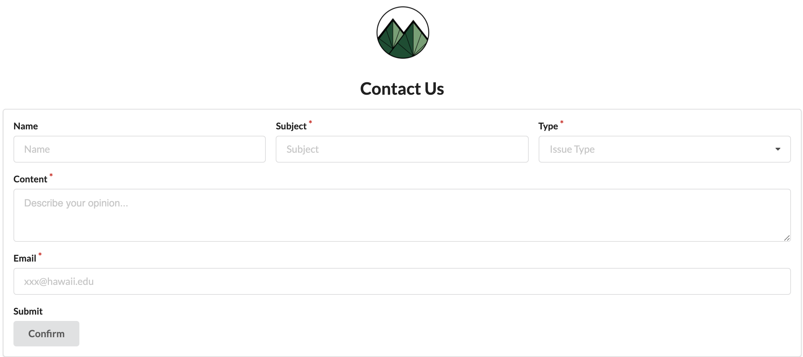

  
  

<h2 id="project-overview">Project Overview</h2>
ManoaList is a platform for UHM students to trade their stuffs. Students must register accounts with their UH email. Students can post their information to the platform, and people are able to contact with them for buying products.

<h2 id="Contribution">My Contribution</h2>
In the group project, my jobs are focus on building functionalities and establishing basic UI design.
<ul>
  <li>Contribute UI design of the Sign In/Sign Up pages, and establish their functionalites</li>
  <li>Create the "Ban User" functionality for Admin that Banned Users's account will be locked</li>
  <li>Customer service system</li>
</ul>

<h2 id="experience">What I learned</h2>
This is my first time to attend a group project. It's a great experience for me to learn working with people in a big project. It makes me realize that the significance of teamwork. My team is amazing because everyone has their own advantages for accomplishing the project, so we have a very good efficiency for doing the project.
I also practice my skills by using Meteor for UI design and database and learn how to develop a website. That's a great opportunity for me. 
link of the code: <a href="https://github.com/manoalist/manoalist"><i class="large github icon"></i>ManoaList</a>
