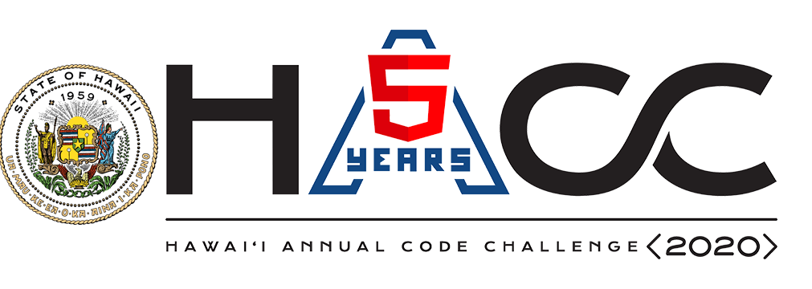

## Hawaii Annual Coding Challenge (HACC)

<a href="https://hacc.hawaii.gov/">Hawaii Annual Code Challenge (HACC)</a> is a hackthon-inspired competition that designed to encourage tech communities to support and develop the IT industry in Hawaii. Participants can feel free to form a team and select their topic in a set of coding challenges. 
I attended this competition with my friends <a href="https://yuhanj.github.io/">Yuhan Jiang</a> and <a href="https://heweiron.github.io/">Weirong He</a> as Team Trigeeks, and we won the 3rd place in this year. 

## Project Overview
Today, many people still use spreedsheet to manage event and building access. It is a low-efficiency and inconvenience way for users to edit and check the data. And it cannot really help users to improve the security of their places. 
Traditionally, physical monitor rooms take the most of responsibility of building security. It might require a lot of cost on equipment and labor if people want to have a strict building management system. However, we find the way to solve the challenge with low cost to some extent. 
UHShield is a powerful mobile iOS-platform app that help UH Staff to manage events and building access. It provides a real-time database to record information and data and keep them privately, and user-friendly interface to help staffs to enhance their work efficiency.

## Feature
We assume that there are two basic roles for staffs in a building: 
### Reception 
- Receptions are able to check the overall event calendar in their workplaces. 
- They can easily scan the QR-Code for doing checkin if guests provide their checkIn QR-Code. And then the app will automatically record guests information into our system.
- They can simply records badges with guests information when they assigned badges out. It is easy for recycle badges from guests when they do check out.

### Sponsor
- Sponsors are able to create/edit events quickly by using the app. When they assign room and time for their events, they do not need to go through the spreedsheet to check availabilities because UHShield has the time conflict interception functionality to handle this kind of issue.
- After Sponsors create their events, they can generate QR-Code for their guests and send them out by Email. The QR-Code can be considered as a ticket for guests. It is helpful for reception to recognize their identity information
- Sponsors can take attendance for this event and report issues to reception to take further secure actions. 

## How does UHShield handle/find security issues in the real life? 
We design this app to strengthen the interoperability between each department so that they can maintain the building security together in some very easy steps. 
- After Reception checked in guests and assigned badges to them, the guest name will be activated on guest list on the corresponding Sponsor end.
- So the guest will be assume in the state: Already checked in, But have not arrived the room yet.
- When the guest arrived in the room, Sponsor can take the attendance, and mark the guest as arrived in our security system.
### How do we find the security issue?
- When an event starts, Sponsor can take attendance to check who checked in but not in the room at the time. Sponsor can quickly find the possible issue by looking the checking time of the guest. And then Sponsor can directly report issues to physical monitor and provide information to help them figure it out.
- Receptions check the attendance list by getting feedback from Sponsor end and find security issues just same as the Sponsor.
#### More efficient than only rely on physical monitor to handle the security issue !

## Project Conclusion
This app is trying to solve building security issues without any additional cost by optimizing the workflow and simplifying the problems. 
It is like we implement a optimization algorithm to allocate tasks for each core. It is a very common situation that only one core is working and others are just "taking break". The best way to improve efficiency in this case is distributing works from the one is working to others. Even though people have different roles and reponsibilities in the real life, but we still can find the point/angle to do the optimization. 

  
  
  

## My Contribution
In the Team Trigeeks, I focus on the core functionality development and basic UI module. 
- Create Time conflict interception functionality
- Enhance sending email functionality
- Check-in/take attendance functionality 
- Create data models for connecting with the Firebase
Also made the Animation of the app.

## What I learn from this event
    I have to say thanks for my other two teammates because I cannot win the price without them. We discussed and shared ideas with each other to come out a solution for doing the challenge. We argued with each other when we have different opinions about one thing, but we also liked to hear about suggestion from each other. And also we supported each other during the process when someone was stucked by some technic issues. 
    Since we just learned how to build a native mobile app in this semester, there are a lot of thing we need to learn. In the beginning, we will share good study resource and experience what we have learned about it. However, we are also very independent. We believe that the best way to cooperate with each other in project is Everyone master the technic. So everyone should has a complete understanding about the technic rather than only taking charge some part of the overall. 
    It is like if the Project = A + B + C, we believe that we all should master the A, B, and C rather than distribute the tasks individually. Even though we might take our own responsibility in the real work, but we work on our way for a better communication in the process. Since we all have complete understanding about it, when someone was stucked by some issues, other two people can provide useful imformation or opinions to quickly help him solve it. 
    I just really enjoy work with my teammates because we have a very good atmosphere in the team. No one like being lazy and miss the due day, so that everyone is highly engaged for building the app. Sometime I feel that I am also competing with my teammates, and I need to keep highly motivation each day in the process. Otherwise, I may not have too much contribution to the team project. 
    This is the first time I feel that the improtance of staying in a excellent team. The work environment will keep me motivated and force me to learn and improve my skills. And also it is a wonderful experience for me that my team got the 3rd place in the HACC 2020. It is the first time in my life to win a price in a large competition. 
    Learning new stuff is pain because it means that I need to jump out of my safe zone and take challenges. But I am glad I achieved it.
    I pained and I gained. 
    
    
    Devpost Page: <a href="https://devpost.com/software/uhshield">UHShield</a>
    Github Repo Source : <a href="https://github.com/HACC2020/Trigeeks"><i class="large github icon "></i>UHShield</a>
