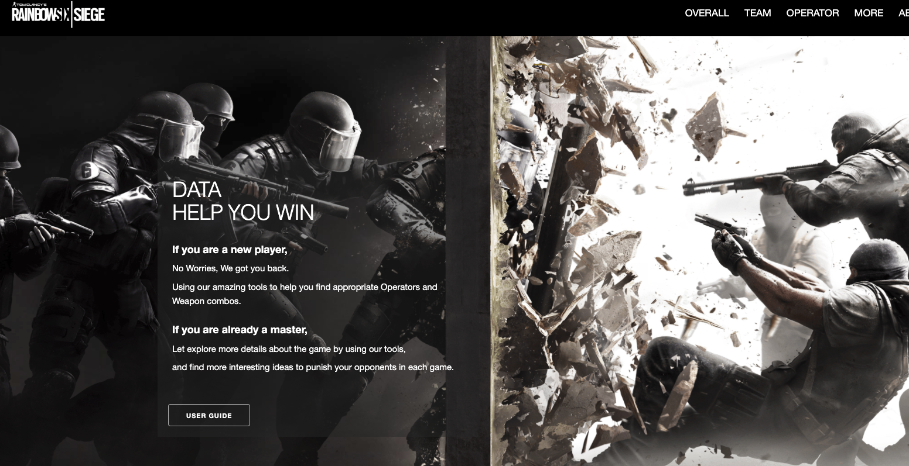
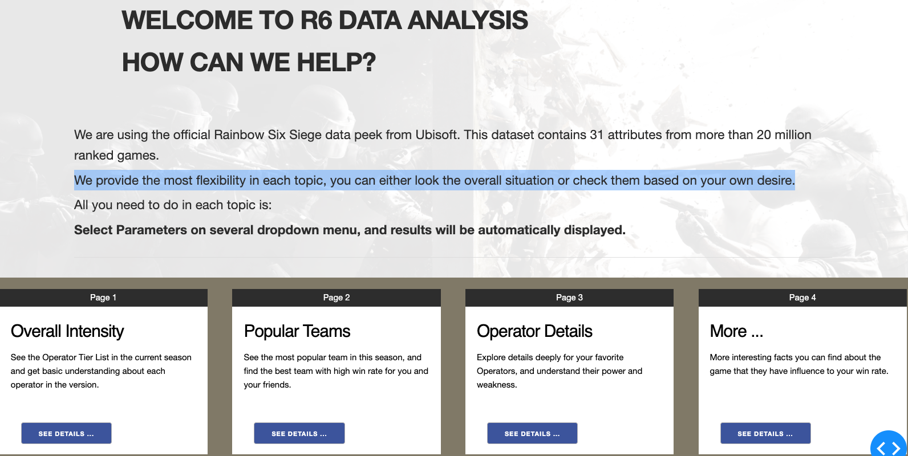
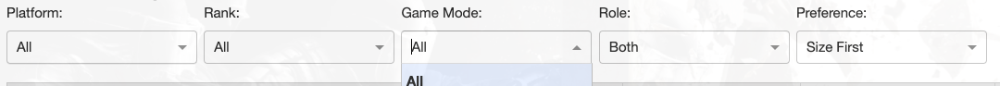
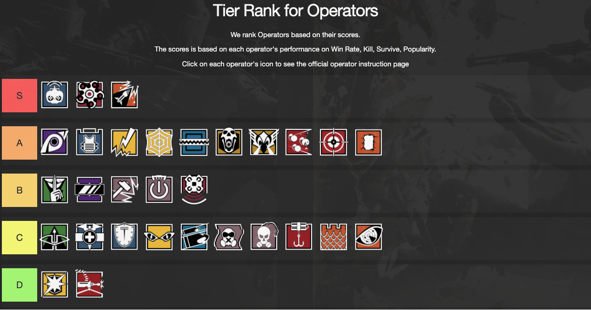
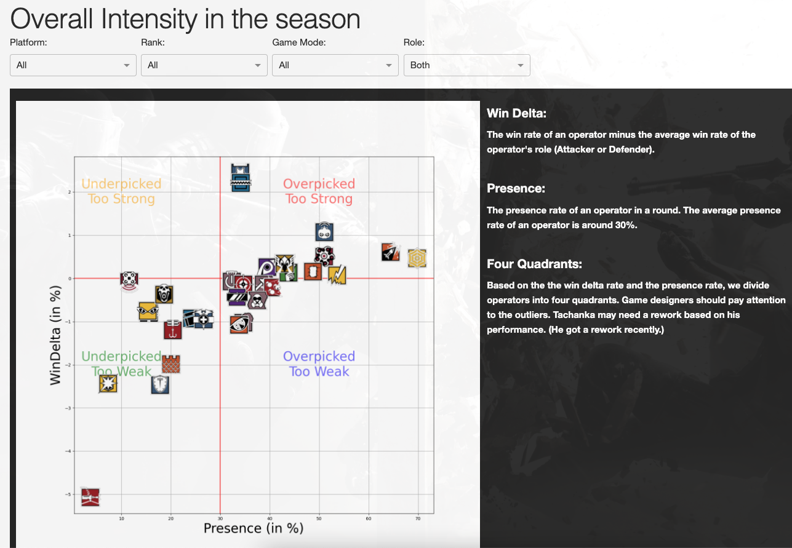
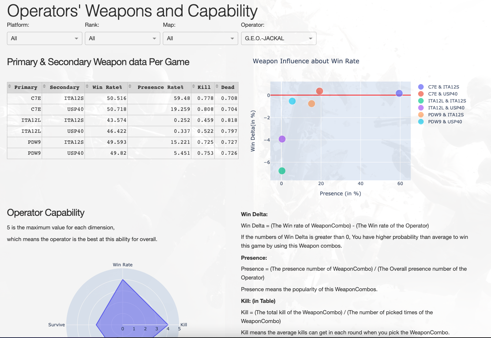

## Project Overview
It is a interactive web app for visualizing the video game Rainbow Six Siege. We use the offical Rainbow Six Siege data peek from Ubisoft. This dataset contains 31 attributes from more than 20 million ranked games. In order to help players find more useful information for themselves by using the web app, we provide the most flexibility in each topic.

## Feature
### Most of interesting Topics for all level players
- We prepare several regular topics such as Overall Intensity, Popular Teams, Operator Details ..., every topic can help players to get more ideas and deeper understanding about the game.

### Customize Data set based on personal desires. 
- No matter which level of players you are, you can find useful information and data so that you might improve your win rate. 
- Players can select Parameters on the dropdown menus, and results will be automatically calculated and displayed. Users can fit their own situations by customizing the data set, so the result will be more meaningful and useful for them. 

## Project Conclusion
We are trying to provide an useful tool for Rainbow Six Siege's players to visualizing the data and discover the interesting facts under the data. Analysis Data and learn from data is the purpose of developing this web app because data do not lie at the most of time. We believe that players can improve their skills and win rate by appropriately analyzing data.

  
  
  

## My Contribution
In the Team Triple Six, I focus on the Web Design and Development, Data analisys. 
- The web UI design
- Analysis the raw data
- Create core functions to achieve the interactive functionalities

Github Repo Source : <a href="https://github.com/ICS-484-Rainbow6/Rainbow6"><i class="large github icon "></i>Rainbow Six Siege Data Visualization</a>
